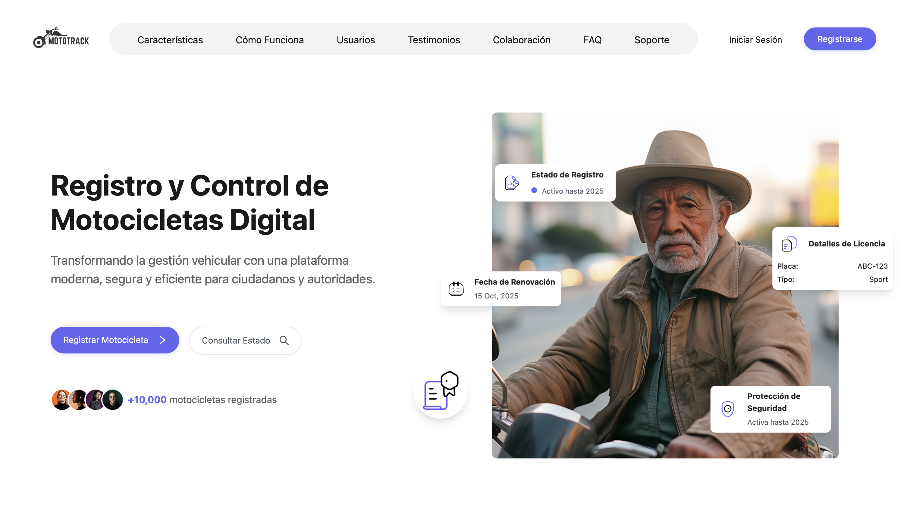

<div align="center">



# 🏍️ MotoTrack

**Gestión y seguimiento de motos, todo en un solo lugar.**

[](https://nodejs.org/)
[](https://react.dev/)
[](https://moto-track-front.vercel.app)
[](LICENSE)

🌐 **[moto-track-front.vercel.app](https://moto-track-front.vercel.app)**

</div>

---

## 📋 Tabla de Contenidos

- [Sobre el Proyecto](#-sobre-el-proyecto)
- [Estructura del Proyecto](#-estructura-del-proyecto)
- [Tech Stack](#-tech-stack)
- [Instalación](#-instalación)
- [Variables de Entorno](#-variables-de-entorno)
- [Scripts Disponibles](#-scripts-disponibles)
- [Contribución](#-contribución)
- [Licencia](#-licencia)

---

## 🏍️ Sobre el Proyecto

**MotoTrack** es una aplicación fullstack para la gestión y seguimiento de motos. Permite a los usuarios administrar vehículos, rutas y reportes desde una interfaz moderna e intuitiva, respaldada por una API RESTful robusta.

El proyecto está compuesto por dos módulos independientes:

- **`MotoTrackBackend`** — API RESTful con Node.js y Express
- **`MotoTrackFrontend`** — SPA con React desplegada en Vercel

---

## 📁 Estructura del Proyecto

```
AllMotoTrack/
│
├── MotoTrackBackend/          # API RESTful (Node.js + Express)
│   ├── src/
│   ├── .env.example
│   ├── ScriptDbMotoTrack.sql
│   └── package.json
│
├── MotoTrackFrontend/         # Aplicación web (React)
│   ├── src/
│   │   ├── assets/
│   │   ├── Auth/
│   │   ├── Dashboard/
│   │   ├── Lading/
│   │   │   ├── CharacteristicsSection/
│   │   │   ├── CollaborationSection/
│   │   │   ├── FAQSection/
│   │   │   ├── FooterSection/
│   │   │   ├── Hero/
│   │   │   ├── HowitWorksSection/
│   │   │   ├── Nav/
│   │   │   ├── PrefooterSection/
│   │   │   ├── TestimonialsSection/
│   │   │   └── UsersSection/
│   │   ├── components/
│   │   ├── context/
│   │   ├── data/
│   │   ├── Layout/
│   │   ├── pages/
│   │   ├── utils/
│   │   ├── App.jsx
│   │   └── index.css
│   └── package.json
│
└── README.md
```

---

## 🛠 Tech Stack

### Backend

- **[Node.js](https://nodejs.org/)** — Entorno de ejecución JavaScript
- **[Express](https://expressjs.com/)** — Framework web minimalista y flexible
- **SQL** — Base de datos relacional (script incluido en `ScriptDbMotoTrack.sql`)

### Frontend

- **[React](https://react.dev/)** — Biblioteca de UI declarativa
- **[Vite](https://vite.dev/)** — Build tool y servidor de desarrollo
- **[Vercel](https://vercel.com/)** — Plataforma de despliegue

---

## 🚀 Instalación

### Prerrequisitos

- **Node.js** >= 18.x
- **npm** >= 9.x

### Backend

```bash
cd MotoTrackBackend
npm install
```

Configura tus variables de entorno (ver sección siguiente) y ejecuta:

```bash
npm run dev
```

El servidor estará disponible en `http://localhost:3000`.

### Frontend

```bash
cd MotoTrackFrontend
npm install
npm start
```

La app estará disponible en `http://localhost:5173`.

---

## 🔑 Variables de Entorno

En el directorio `MotoTrackBackend`, crea un archivo `.env` basado en `.env.example`:

```bash
cp .env.example .env
```

Edita el `.env` con tus credenciales de base de datos y configuración del servidor.

---

## 📜 Scripts Disponibles

### Backend

| Comando         | Descripción                           |
| --------------- | ------------------------------------- |
| `npm run dev`   | Inicia el servidor en modo desarrollo |
| `npm run build` | Compila el backend para producción    |

### Frontend

| Comando         | Descripción                      |
| --------------- | -------------------------------- |
| `npm start`     | Inicia la app en modo desarrollo |
| `npm run build` | Compila la app para producción   |

---

## 🤝 Contribución

1. Haz un fork del repositorio
2. Crea tu rama de feature
   ```bash
   git checkout -b feature/nueva-funcionalidad
   ```
3. Commitea tus cambios
   ```bash
   git commit -am 'Agrega nueva funcionalidad'
   ```
4. Haz push a la rama
   ```bash
   git push origin feature/nueva-funcionalidad
   ```
5. Abre un **Pull Request**

---

## 📄 Licencia

Este proyecto está bajo la licencia **MIT**. Consulta el archivo [LICENSE](LICENSE) para más detalles.

---

<div align="center">

Hecho con ❤️ · **MotoTrack**

[🌐 Demo en vivo](https://moto-track-front.vercel.app)

</div>
